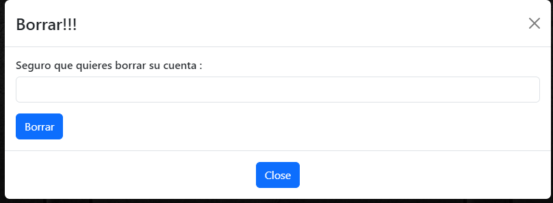

Creación de la parte Frontal del estudio de Tatuajes.

Se han utilizado los sieguentes lenguajes:

    React + TypeScript + Vite
    ReactBootstrap
    Css
    Backend Proyecto 4

Un diseño simple y basico pero con una logica buena

la pagina principal de home , sin estar loqueado :

pero cuando inicias session :

La parte de Login y Register
con un diseño de inputs , fonts de google y un poco de ajuste 
ha quedado un diseño casi perfecto

Perfil del usuario
con un diseño tipo tarjeta donde te muestra tus datos y
si es admin muestra los datos de todos , para poder buscar algo en concreto en 
el nav bar se ha incorporado 3 metodos de busqueda, que es 
por el rol , email y borrado logico.

para modificar el perfil lo he implementado con un modal, con un diseño muy basico
para poder borrar el perfil necesita una confirmación antes.

Sessiones 
el mismo diseño que el de profile
no tiene implementado los metodos de busqueda (actualmente).
tiene un boton basico para poder crear nuevas citas
donde te aparece automaticamente la fecha (que solo se puede escoger de el dia de hoy en adelante , de Lunes a Viernes y con horrario de 9:00 @ 14:00 / 15:00 @ 18:00)
el tipo de intervención tatuaje o piercing 
y con quien quieres tatuarte.
el diseño muy bascio pero funcional.

El Proyecto no esta acabado , seguire trabajando en el e intentar mejorarlo todo lo posible

Creado por @Alin Petrisor Ciobanu